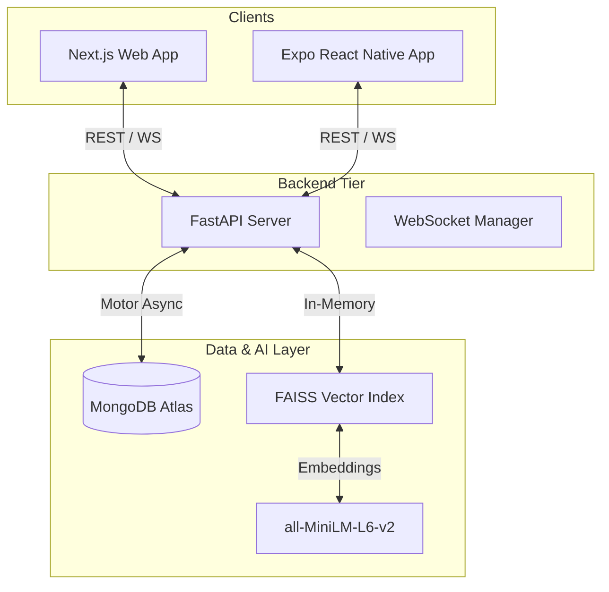

# Alumni Nexus: Comprehensive Project Documentation

Alumni Nexus is a state-of-the-art, AI-powered digital ecosystem designed to bridge the gap between alumni and students. It facilitates mentorship, skill-based collaboration, and real-time networking through a unified platform accessible via Web and Mobile.

---

## 1. Project Vision & Objectives

### Vision
To empower educational communities by leveraging AI to create meaningful connections, enabling knowledge transfer, and accelerating career growth through a seamless digital experience.

### Key Objectives
*   **Intelligent Mentorship**: Automated mentor matching using vector similarity search (FAISS).
*   **Skill Marketplace**: A platform for alumni to post projects and students to apply, fostering practical learning.
*   **Real-time Communication**: Integrated WebSocket-based chat for instant guidance.
*   **Knowledge Hub**: A community forum for long-form discussions and institutional updates.
*   **Cross-Platform Access**: Native-feel experience on both web (Next.js) and mobile (React Native/Expo).

---

## 2. System Architecture

The project follows a modern decoupled architecture:



---

## 3. Technology Stack

### Backend (The "Brain")
*   **Runtime**: Python 3.10+
*   **Web Framework**: FastAPI (Asynchronous, High Performance)
*   **Database**: MongoDB (NoSQL) with **Motor** for async operations.
*   **AI/ML**: 
    *   **FAISS**: Facebook AI Similarity Search for high-speed vector indexing.
    *   **Sentence-Transformers**: `all-MiniLM-L6-v2` for generating semantic embeddings.
*   **Authentication**: JWT (JSON Web Tokens) with `Passlib` (bcrypt) for secure password hashing.
*   **Real-time**: Python WebSockets for live chat functionality.

### Web Frontend
*   **Framework**: Next.js 14 (App Router)
*   **Language**: TypeScript (Strict typing)
*   **Styling**: Tailwind CSS with Framer Motion for animations.
*   **UI Components**: Shadcn UI (Radix-based) for a premium look and feel.
*   **Icons**: Lucide React.
*   **State Management**: React Context API & Hooks.

### Mobile App
*   **Framework**: React Native with **Expo**.
*   **Navigation**: React Navigation (Stack & Tab).
*   **Icons**: Expo Vector Icons.
*   **API Client**: Axios with interceptors for auth management.

---

## 4. Database Schema (MongoDB)

### `users` Collection
The core collection storing identity and rich profile data.
```json
{
  "_id": "uuid-string",
  "name": "Full Name",
  "email": "user@example.com",
  "password": "hashed_password",
  "role": "Student | Alumni | Admin",
  "profile": {
    "bio": "Text description",
    "skills": ["Python", "Design"],
    "interests": ["AI", "Fintech"],
    "academic_info": { "college": "...", "branch": "...", "cgpa": 8.5 },
    "professional_info": { "company": "...", "title": "...", "experience": 5 },
    "mentorship_prefs": { "is_available": true, "domains": ["Web Dev"] }
  }
}
```

### `projects` Collection (Marketplace)
```json
{
  "_id": "uuid-string",
  "title": "Project Title",
  "description": "Project details",
  "posted_by": "alumni_id",
  "skills_required": ["React", "Node"],
  "status": "Open | Closed",
  "applicants": ["student_id_1", "student_id_2"]
}
```

### `messages` Collection
Optimized for retrieval of conversation history.
```json
{
  "sender_id": "uuid",
  "receiver_id": "uuid",
  "message": "Hello!",
  "timestamp": "ISO-8601 String",
  "is_read": false
}
```

---

## 5. AI Matching Engine: Deep Dive

The "AI Match" feature uses a **Vector Space Model** to find the most relevant mentors for a student.

1.  **Preprocessing**: On startup, all Alumni profiles are flattened into "Document Strings" containing their title, company, skills, and industry.
2.  **Vectorization**: The `all-MiniLM-L6-v2` model converts these strings into 384-dimensional floating-point vectors.
3.  **Indexing**: These vectors are loaded into a FAISS `IndexFlatL2`.
4.  **Querying**: When a student requests a match, their interests and skills are vectorized and compared against the index using Euclidean distance (L2).
5.  **Efficiency**: This allows the platform to search through thousands of alumni in milliseconds.

---

## 6. API Reference

### Auth Module (`/api/auth`)
*   `POST /register`: Onboard new users.
*   `POST /login`: Generate JWT tokens.

### User Module (`/api/users`)
*   `GET /me`: Fetch authenticated user profile.
*   `PUT /{id}/profile`: Update profile information.
*   `GET /{id}/mentors`: **AI matching endpoint**.

### Marketplace Module (`/api/projects`)
*   `GET /`: Fetch all projects.
*   `POST /`: Create a new project (Alumni only).
*   `POST /{id}/apply`: Apply for a project (Student only).

### Communication Module (`/api/chat`)
*   `WS /ws/{token}`: Real-time messaging entry point.
*   `GET /conversations`: List active chat threads.
*   `GET /history/{user_id}`: Retrieve message logs.

---

## 7. Setup & Installation

### 1. Environment Configuration
Create a `.env` file in the root:
```env
MONGODB_URI=your_mongodb_uri_here
SECRET_KEY=your_super_secret_jwt_key
ALGORITHM=HS256
```

### 2. Backend Setup
```bash
cd backend
python -m venv venv
source venv/bin/activate  # On Windows: venv\Scripts\activate
pip install -r requirements.txt
python run.py
```

### 3. Web Frontend Setup
```bash
cd frontend
npm install
npm run dev
```

### 4. Mobile Setup
```bash
cd mobile
npm install
npx expo start
```

---

## 8. Development Roadmap

- [x] Phase 1: Core Authentication & Profile Management.
- [x] Phase 2: AI Mentor Matching with FAISS.
- [x] Phase 3: Real-time Chat & WebSockets.
- [x] Phase 4: Skill Marketplace & Project Application.
- [x] Phase 5: Mobile App development with Expo.
- [ ] Phase 6: Video conferencing integration (WebRTC).
- [ ] Phase 7: Automated Resume Reviewer (LLM Integration).
- [ ] Phase 8: Global Notification System (Push/Email).

---

## 9. Maintainer Notes
*   **Vector Sync**: The FAISS index is updated on server startup. In a scaling environment, this should be moved to a background task or a dedicated vector database.
*   **Security**: Always ensure the `SECRET_KEY` is kept confidential and changed in production environments.

