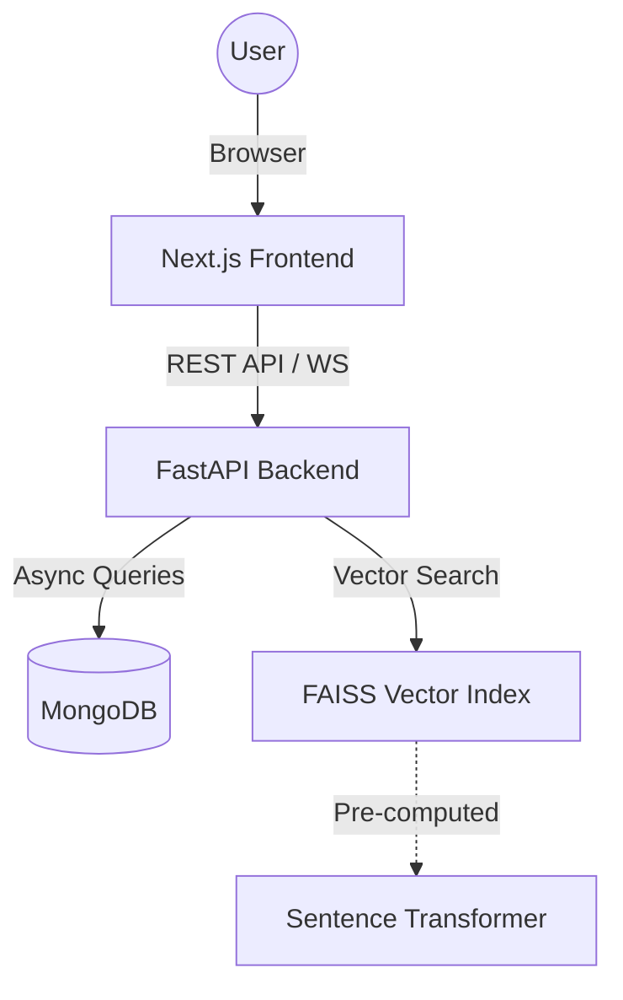

# Alumni Nexus: Project Documentation

Alumni Nexus is an AI-powered digital ecosystem designed to foster engagement, mentorship, and career development within alumni networks. This platform bridges the gap between current students and alumni through intelligent matching, real-time communication, and collaborative marketplaces.

---

## 1. Project Overview

### Vision
To create a seamless, AI-driven platform where students can find guidance from experienced alumni, collaborate on projects, and participate in a vibrant professional community.

### Key Objectives
- **AI Mentorship**: Automate the process of finding the right mentor using vector similarity.
- **Skill Marketplace**: Facilitate project-based collaboration between alumni and students.
- **Real-time Networking**: Provide instant communication channels via WebSockets.
- **Community Building**: Host discussions and knowledge sharing through a dedicated forum.

---

## 2. Technology Stack

### Backend
- **Framework**: FastAPI (Python 3.10+)
- **Database**: MongoDB (NoSQL) with Motor (Async driver)
- **AI Engine**: FAISS (Facebook AI Similarity Search) for vector matching
- **Embeddings**: Sentence-Transformers (`all-MiniLM-L6-v2`)
- **Authentication**: JWT (JSON Web Tokens) with Passlib (bcrypt)
- **Real-time**: WebSockets for instant messaging

### Frontend
- **Framework**: Next.js 14 (App Router)
- **Language**: TypeScript
- **Styling**: Tailwind CSS
- **UI Components**: Shadcn UI / Radix UI
- **Icons**: Lucide React
- **State/Fetching**: React Hooks & Fetch API

---

## 3. Architecture & System Design

### High-Level Flow


### AI Mentor Matching Logic
1.  **Data Sync**: On startup, the backend fetches all "Alumni" profiles from MongoDB.
2.  **Embedding Generation**: For each mentor, a "document string" is created (combining job title, company, skills, and bio). This string is converted into a 384-dimension vector.
3.  **Indexing**: These vectors are stored in a FAISS `IndexFlatL2` in-memory index.
4.  **Querying**: When a student requests a match, their interests and skills are converted into a vector. FAISS performs a similarity search to find the top $K$ nearest alumni vectors.

---

## 4. Database Schema (MongoDB)

### `users` Collection
Stores all user information and detailed profiles.
- `_id`: UUID string
- `email`: Unique string
- `password`: Hashed string
- `role`: "Student", "Alumni", or "Admin"
- `profile`: Nested object containing:
    - `skills`: List of strings
    - `interests`: List of strings
    - `academic_info`: (Students only) College, branch, year, CGPA
    - `professional_info`: (Alumni only) Company, title, industry
    - `mentorship_prefs`: (Alumni only) Availability, domains

### `messages` Collection
Stores chat history.
- `sender_id`: Reference to User ID
- `receiver_id`: Reference to User ID
- `message`: Text content
- `timestamp`: UTC datetime

### `projects` Collection (Skill Marketplace)
- `title`: String
- `description`: String
- `posted_by`: User ID
- `skills_required`: List of strings
- `applicants`: List of User IDs

### `posts` Collection (Forum)
- `content`: String
- `author`: Name/ID
- `likes`: List of User IDs
- `comments`: Nested list of comment objects

---

## 5. API Documentation

### Authentication (`/api/auth`)
- `POST /register`: Creates a new account with role-specific profile structures.
- `POST /login`: Returns a JWT access token and user metadata.

### Users & Profiles (`/api/users`)
- `GET /me`: Returns the current user's profile.
- `PUT /{user_id}/profile`: Updates profile data.
- `GET /{user_id}/mentors`: **AI Endpoint** - Returns top 5 matched mentors using FAISS.

### Chat (`/api/chat`)
- `WS /ws/{token}`: WebSocket endpoint for real-time messaging.
- `GET /conversations`: Lists all active chat counterparts.
- `GET /history/{other_id}`: Retrieves chat history between two users.

### Marketplace & Forum
- `GET /api/projects`: Lists available projects.
- `POST /api/projects/{id}/apply`: Apply for a project.
- `GET /api/posts`: Lists forum discussions.

---

## 6. Setup & Installation

### Prerequisites
- Python 3.10+
- Node.js 18+
- MongoDB Atlas account (or local instance)

### Backend Setup
1.  Navigate to `backend/`.
2.  Install dependencies: `pip install -r requirements.txt`.
3.  Configure `.env`:
    ```env
    URI=mongodb+srv://... (Your MongoDB URI)
    SECRET_KEY=... (For JWT)
    ```
4.  Run server: `uvicorn app.main:app --reload`.

### Frontend Setup
1.  Navigate to `frontend/`.
2.  Install dependencies: `npm install`.
3.  Run development server: `npm run dev`.
4.  Open `http://localhost:3000`.

---

## 7. Deployment

### Dockerization
The project includes `Dockerfile`s for both backend and frontend.
- **Backend**: Uses `python:3.10-slim` for a lightweight API container.
- **Frontend**: Optimized for production builds in a Node environment.

### Production Recommendations
- **Database**: Use MongoDB Atlas for managed scaling.
- **Hosting**:
    - Backend: AWS ECS, Google Cloud Run, or Render.
    - Frontend: Vercel or Netlify (ideal for Next.js).
- **Security**: Ensure `allow_origins` in CORS is restricted to your production domain.

---

## 8. Future Roadmap
- **Video Mentorship**: Integration with Zoom or WebRTC.
- **AI Resume Reviewer**: Automated feedback for student resumes.
- **Event Management**: Alumni-led webinars and meetups.
- **Mobile App**: Cross-platform mobile experience using React Native.
